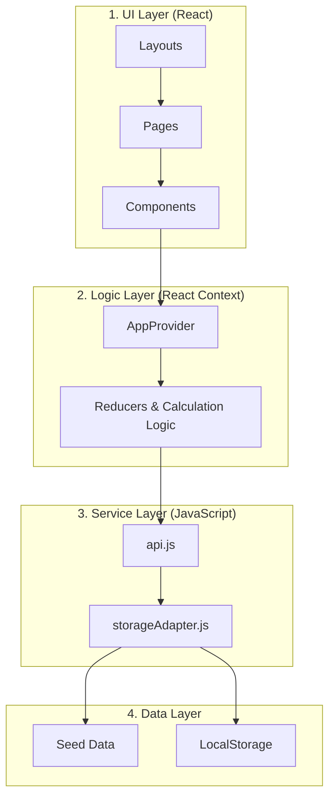

# Rodeo Restaurant - Technical Architecture & Systems Guide

A comprehensive map of the Rodeo Menu application, covering architecture, component logic, data relationships, and the automated ordering system.

---

## 🏗️ 1. Global Systems Architecture

The application uses a **Layered Architecture** to separate user interaction from business logic.

---

## 📂 2. File Structure & Responsibilities

| Directory | Role | Description |
| :--- | :--- | :--- |
| `src/assets/` | Static Assets | Brand images, global icons, and static images. |
| `src/components/` | Reusable Units | Small, stateless UI pieces (Buttons, Inputs, Cards). |
| `src/components/admin/` | Admin Tools | Specialist components like the `MenuGrid` or `OrderRow` for the dashboard. |
| `src/context/` | Global State | The **"Brain"** — handles complex state like Cart and authentication. |
| `src/layouts/` | Structural Wrappers | Defines the persistent "Shell" (e.g., `AdminShell`). |
| `src/pages/` | Routed Views | High-level containers for each route (Welcome, FoodDetails). |
| `src/services/` | API / Backend Sims | Simulates a REST API using the local storage adapter. |

---

## 🧩 3. Component Taxonomy & Relationships

### Core Global Components
- **`Header`**: Consumes `AuthContext` to show user status and `handleCallWaiter` for staff alerts.
- **`BottomNav`**: Displays real-time `cartCount` from `CartContext` and provides navigation for the customer app.
- **`AdminShell`**: A master layout that provides the sidebar, top bar, and ensures `RequireAuth` protection for all children.

### Component-Context Relationships
Every component interacts with one or more specialized contexts:
1.  **Read-only Components**: E.g., `OrderSummary` reads `items` and `totals` from `CartContext`.
2.  **Mutation Components**: E.g., `QuickAddButton` uses `addItem` from `CartContext`.
3.  **Cross-Domain Components**: E.g., `CheckoutButton` reads from `CartContext` but calls `createOrder` from `OrdersContext`.

---

## 📑 4. Page Logic & Flow

### Customer Experience Loop
1.  **Welcome (`/`)**: A high-impact entry using `framer-motion` to build brand atmosphere.
2.  **Categories (`/categories`)**: 
    - Fetches `quickCategories` and `allFoods`.
    - Implements **Search** and **Category Filtering** in local state.
    - Manages the horizontal scroll for category selection.
3.  **FoodDetails (`/food/:id`)**: 
    - Uses `useParams` to find the specific dish.
    - Provides detailed reviews, ratings, and quantity selectors.
4.  **OrderList (`/orders`)**: 
    - The "Cart" view. Shows all pending items.
    - Triggers `cartTotals` calculation.
5.  **Payment / Success**: 
    - Finalizes the order, clears the cart, and displays the success animations.

---

## ⚡ 5. The "Life of an Order" (Order Logic)

The ordering system is the most complex part of the app. It follows a strict "Chain of Responsibility" pattern.

### Step 1: Accumulation
Items are pushed into an array in `AppProvider`.
- Trigger: `addItem(dish)`
- Logic: If item exists, increment `qty`. Otherwise, append with a unique `cartId`.

### Step 2: Calculation (The Financial Engine)
Every change to the cart triggers a state recalculated using `useMemo`:
- **Subtotal**: Sum of `(price * quantity)`.
- **Tax**: `Subtotal * 0.075`.
- **Discount**: Applies 10% if Subtotal is $>50$.

### Step 3: Fulfillment (Serialization)
1.  Admin verifies order in `OrderQueue`.
2.  Status changes: `pending` → `preparing` → `completed`.
3.  Context refreshes across all admin views (`Dashboard`, `Orders`, `Analytics`) using `orderApi.refresh()`.

---

## 🔐 6. Authentication Architecture

The app uses **Session-based persistence**:
- **`RequireAuth.jsx`**: A Higher-Order Component (HOC) that wraps all `/admin/*` routes. It validates if `user.role === 'admin'`.
- **Persistence**: Login status is stored in `sessionStorage`. This ensures that closing the tab logs the user out, but refreshing the page maintains the session.

---
Developed by the Rodeo Team.
